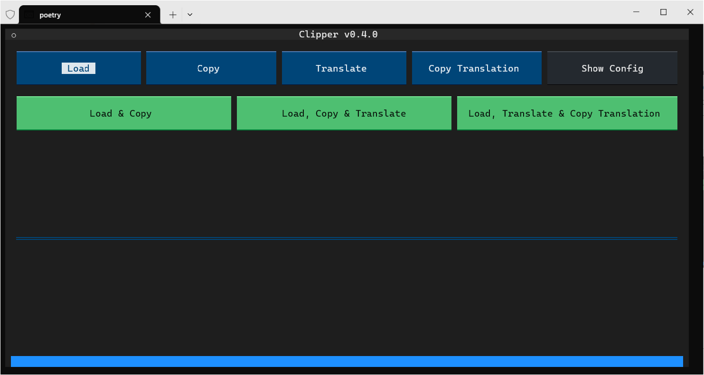

# clipper
Originally made for essay-reading purpose (now you can also utilize it to get texts in slides translated), clipper is a simple [TUI-based](https://github.com/Textualize/textual) Python app to extract text from clipboard and translate it using extensible translation services, with custom RegEx pre- and post-processing support.



## Installation & Usage
This project is managed by [Poetry](https://python-poetry.org/).

To install, run the following commands after cloning the repository:

```bash
poetry lock
poetry install
cp config.example.json config.json
```

After installing dependencies, open `config.json` and fill in the necessary information. Specifically, `api.secrets` might differ depending on the translation service you use - Check the table [below](#built-in-apis) for more information.

The config file is validated by [json-schema](https://json-schema.org/). See [`config.schema.json`](./config.schema.json) for the schema.

Hot-reloading of the config file is supported. You can modify the config file while the app is running, and it will be automatically reloaded.

Then, you can run the app by:

```bash
poetry run clipper
```

There are four blue buttons representing main functions of the app:
- `Load`: load text from clipboard, removing all line breaks
- `Copy`: copy the processed text by `Load` to the clipboard
- `Translate`: translate the loaded text using the selected translation service
- `Copy Translation`: copy the translated text to the clipboard

There are also three green buttons, which are just shortcuts to some combinations of the blue buttons:
- `Load & Copy`
- `Load, Copy & Translate`
- `Load, Translate & Copy Translation`

Apart from above, there is a gray button to open `config.json` in your default text editor.

### Translation API
#### Built-in APIs
| ID | Provider | Name | Required Secrets | Docs | Note |
| :-: | :------: | :--: | :--------------: | :--: | :---: |
| `baidu` | Baidu | General Translate API | `appid`, `appkey` | [Link](https://fanyi-api.baidu.com/doc/21) (Simplified Chinese) | - |
| `lingocloud` | LingoCloud | Translate API | `token` | [Link](https://docs.caiyunapp.com/lingocloud-api/) (Simplified Chinese) | - |

Set `api` in your config file to the ID of the translation API you want to use, and `api.secrets` to the corresponding secrets required.

#### Add Custom API
To add a custom translation API, you need to extend the [`BaseTranslationAPI`](./clipper/api/base.py#L9) class (or [`TranslationAPIWithAppID`](./clipper/api/base.py#L40) / [`TranslationAPIWithToken`](./clipper/api/base.py#L53) if secrets are required) and implement the `translate` method.

Then, you can add the new API to [`__TRANS_API`](./clipper/api/__init__.py#L11) dict. You may also want to add its ID to the type hints of `type` parameter in [`create_api`](./clipper/api/__init__.py#L17) and [`enum`](./config.schema.json#L9) in config schema to get better intellisense support.

Finally, set `api` and `api.secrets` in your config file and everything should work.

### RegEx Pre- and Post-Processing
Clipper supports custom RegEx pre- and post-processing. You can add your own RegEx and replacement in `processor.input` and `processor.output` in the config file.

For example, to keep list structure in PDF slides and convert it to Markdown style, you can add the following to `config.json`:

```json
"processor.input": [
    {
        "regex": "(\r)*\n(?![•⚫➢])",
        "replace": " "
    }
],
"processor.output": [
    {
        "regex": "(^|\n)[•⚫➢] ",
        "replace": "\\2- "
    }
]
```

This will replace all line breaks not followed by `•`, `⚫`, or `➢` with a space, and replace all `•`, `⚫`, or `➢` followed by a space with `- `.

## License
[AGPLv3](./LICENSE)